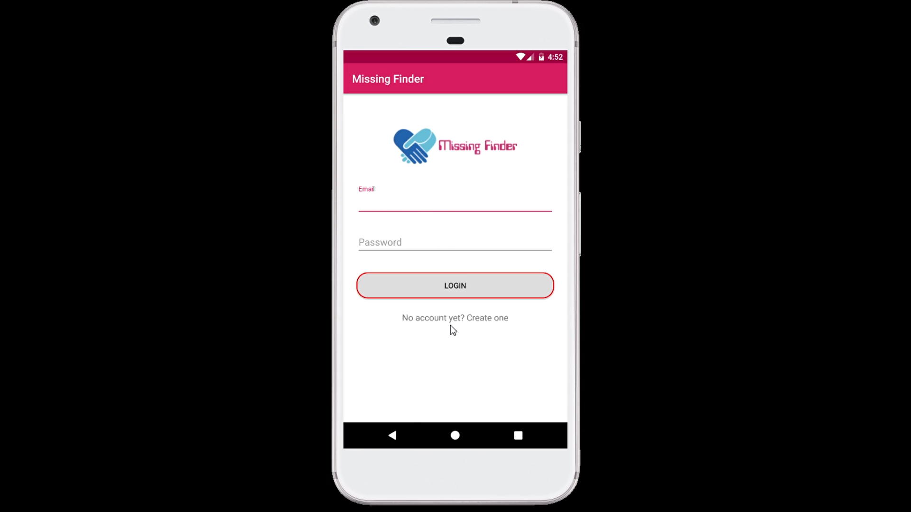
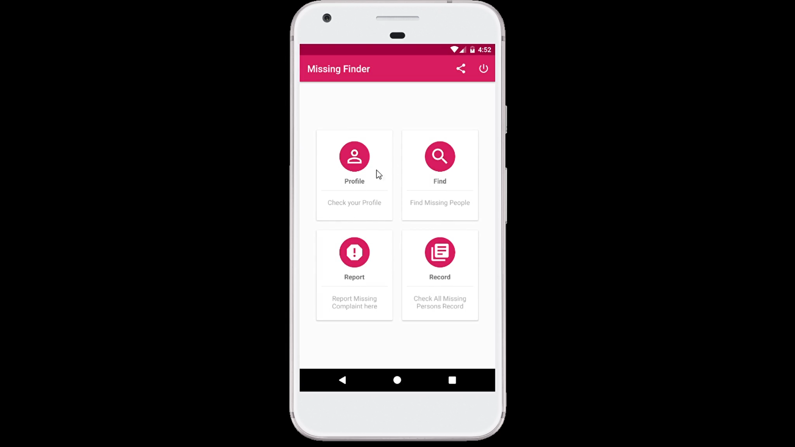
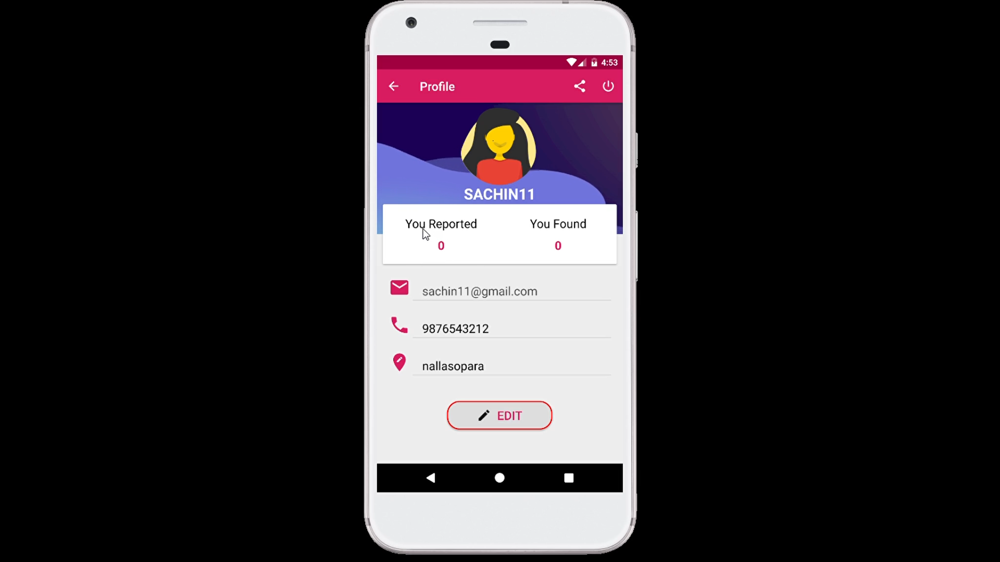
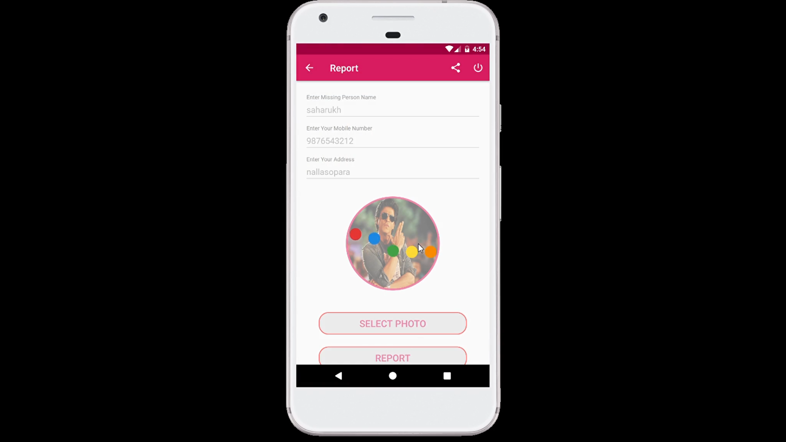
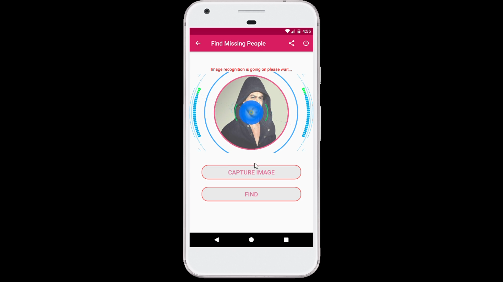
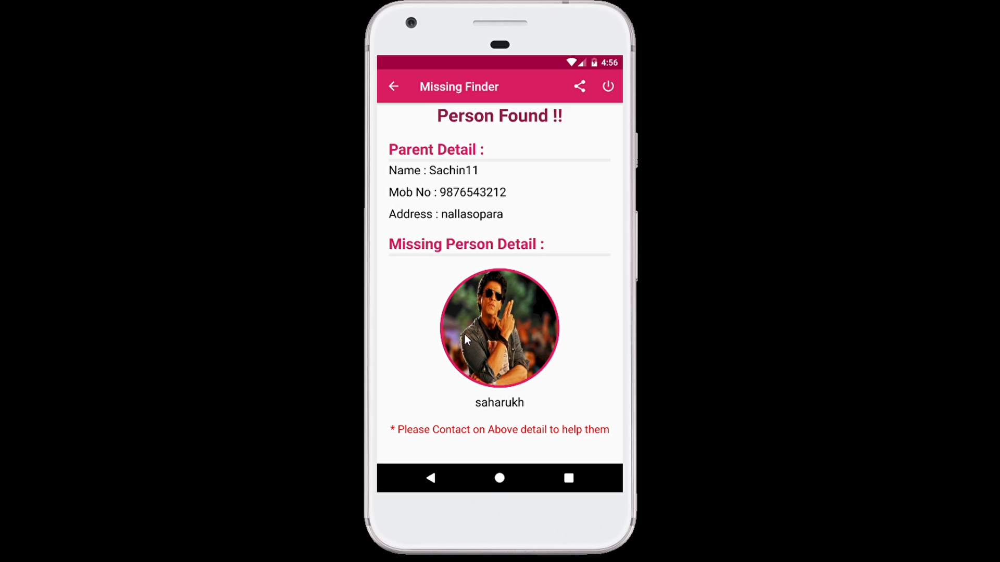

# Missing_Finder Android App
This is an *Android app* that communicates with the django API on my repo with the name [Missing_Finder](https://github.com/sachinsav/Missing_Finder). Anyone can find the lost (lost) person using this app. The app sends the image to the server (ie Django API) that performs face recognition and returns the result, then Android processes that result and shows the appropriate information to the user.

---

For knowing more about app watch [This Video](https://youtu.be/yPS_xMH98hE)

---

## Preview of App is shown below :

### Login Screen :

---

### Home Screen :

---

### Profile Screen :
* Here user can see their profile as well as can edit it.

---

### Report Screen :
* Here user can file report for missing person.

---

### Records Screen :
* Here user can view all the missing persons records.

---

### Find Person Screen :
* Here user can verify that the person is missing one or not.

---

### Person Found Screen :
* If person found in the database it will show this screen.

